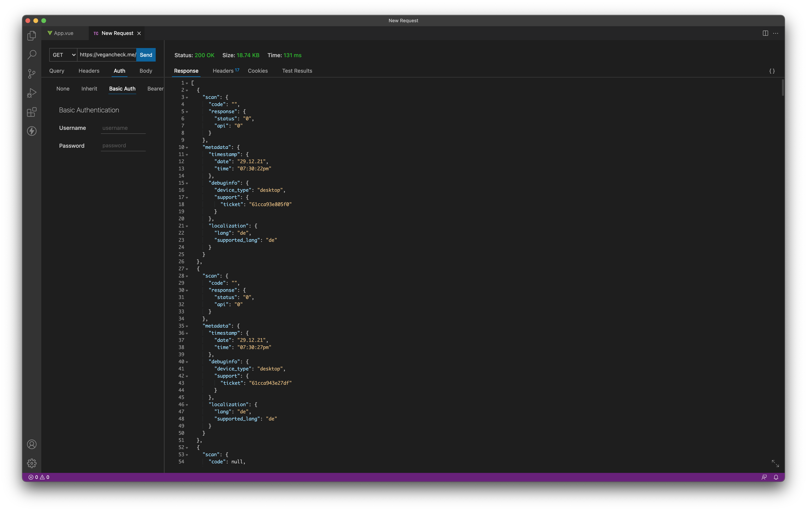

<h3 align="center">VeganCheck.me Stats</h3>

<p align="center">
  Get statistics & debug-information for your VeganCheck.me instance
</p>

## 
  <p align="center">
	<a href="https://jokenetwork.de/badges"></a>
<a href="https://github.com/sponsors/philipbrembeck"></a>
<a href="https://www.paypal.com/donate?hosted_button_id=N4F7DAQH7ET2G"></a>
<a href="https://www.google.com/url?sa=t&rct=j&q=&esrc=s&source=web&cd=&cad=rja&uact=8&ved=2ahUKEwiu55i698D0AhUBhv0HHREZAfQQFnoECAcQAQ&url=https%3A%2F%2Fworld.openfoodfacts.org%2Fdonate-to-open-food-facts&usg=AOvVaw0TQJPEYo7QsZ3ZCoob11bD"></a
  </p>
  
  
## 👨🏼‍💻 Overview

VeganCheck.me's `stats.php` writes non-personal data to a `stats.json`-file every time someone scans a product or enters a product code on [VeganCheck.me](https://vegancheck.me).

  
## How, which and why we collect data

### How do you collect data?
  
Everytime someone requests data from our [`script.php`](https://github.com/JokeNetwork/vegancheck.me/blob/main/script.php)-file (e.g. through the form on VeganCheck.me), `stats.php` generates data, as it's integrated into [`script.php:165`](https://github.com/JokeNetwork/vegancheck.me/blob/main/script.php#L165):
```` php
include("stats.php");
````

### Which data do you collect?

We only collect data which we use to find out which language we need to localize our site to next, which products cause errors in our code/in the API and to help you, if you report an issue.

This is the data we collect: 
- Scanned code
- API response (Which API responded, if there was a positive response)
- Timestamp
- Device-Type (Desktop or mobile)
- Browser language
- Ticket-ID (which can be used to report an issue)

### Why do you collect data?

As mentioned before, we only collect data which is non-personal and which can not be directly linked to you, so we do not create profiles and there is no sort of profiling involved. The only way to link your scan to yourself is, if you're creating an issue with your ticket id.
We only collect data to make sure that our service works as expected and to help our development. 
  
## Sample `stats.json`-Output
````json
  {
		"scan": {
			"code": "3274080005003",
			"response": {
				"status": "2",
				"api": "fallback OFF"
			}
		},
		"metadata": {
			"timestamp": {
				"date": "30-12-2121",
				"time": "08:05:11pm"
			},
			"debuginfo": {
				"device_type": "desktop",
				"support": {
					"ticket": "61ce02e6ea2fc"
				}
			},
			"localization": {
				"lang": "de",
				"supported_lang": "de"
			}
		}
	}
````
That's all `stats.php` generates.
